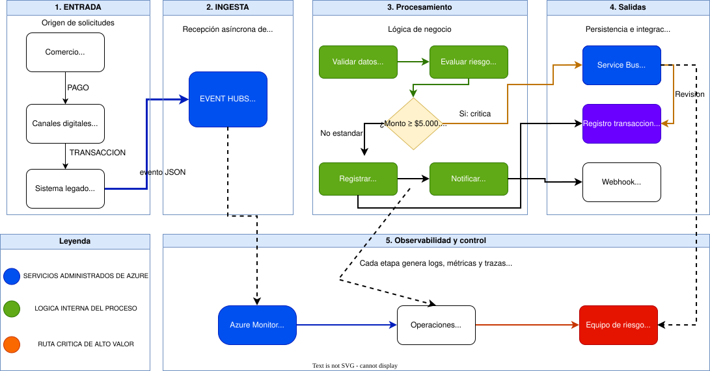

# Caso 3 - Procesamiento de Eventos en Tiempo Real

## 1. Portada

**Institución:** Tecnológico de Antioquia  
**Curso:** Computación en la Nube  
**Semestre:** 2026-1  
**Caso:** Caso 3 - Procesamiento de Eventos en Tiempo Real  
**Empresa:** PayFlow  
**Plataforma:** Microsoft Azure  
**Entrega:** Repositorio GitHub público con README.md como documento principal  

## 2. Integrantes

- Integrante 1:Yean Kevin Marquez Alvarez
- Integrante 2:Juan Camilo Arroyave Monsalve
- Integrante 3:Yesid Mateo Hincapie Duque
- Integrante 4:Diover Farley Sanchez Salazar
- Integrante 5:Jhon Alexander Múnera Peláe

## 3. Contexto del caso

PayFlow es una fintech colombiana que procesa pagos digitales para pequeños y medianos comercios. Actualmente opera con una arquitectura monolítica y síncrona, lo que genera problemas de escalabilidad, acoplamiento, observabilidad limitada y detección tardía de fraude.


## 4. Problemas identificados

PayFlow tiene actualmente una arquitectura monolítica y síncrona construida en 2020. Cada transacción pasa por un flujo secuencial de validación, autorización, registro y notificación. Esta forma de procesamiento genera varios problemas críticos.

### 4.1 Cuello de botella en picos de demanda

El sistema actual procesa aproximadamente 40 transacciones por segundo. En temporada alta, el volumen de transacciones puede superar esta capacidad, generando acumulación de solicitudes, tiempos de respuesta superiores a 8 segundos y posibles rechazos en terminales de los comercios.

### 4.2 Falta de prioridad entre transacciones

Una transacción de bajo valor y una transacción de alto valor pasan por el mismo flujo y con la misma prioridad. Esto puede ocasionar que un alto volumen de micropagos bloquee transacciones de mayor importancia económica.

### 4.3 Detección de fraude reactiva

El sistema actual aplica reglas antifraude después de autorizar la transacción. Esto significa que, cuando se detecta una operación sospechosa, el dinero ya pudo quedar comprometido.

### 4.4 Observabilidad limitada

No existe un monitoreo centralizado del flujo de transacciones. El equipo de operaciones puede enterarse de fallos por quejas de los comercios, en lugar de recibir alertas automáticas.

### 4.5 Acoplamiento entre autorización y notificación

Si el servicio de notificación al comercio falla, la transacción completa puede verse afectada, aunque la autorización bancaria haya sido exitosa. Esto genera inconsistencias entre PayFlow y las redes de pago.


## 5. Requerimientos no funcionales

La nueva arquitectura debe cumplir con los siguientes requerimientos definidos para PayFlow:

| Requerimiento | Métrica objetivo | Motivación |
|---|---|---|
| Throughput | Procesar hasta 500 transacciones por segundo | Soportar picos de temporada alta sin degradación |
| Latencia de autorización | Menos de 2 segundos en P99 | Evitar timeouts en terminales de comercios |
| Garantía de entrega | At-least-once para transacciones críticas | Ninguna transacción crítica debe perderse |
| Detección de fraude | Evaluación en tiempo real antes de autorizar | Reducir fraude antes de comprometer dinero |
| Desacoplamiento | Notificaciones independientes del flujo principal | Evitar que fallos de webhook reviertan autorizaciones válidas |
| Observabilidad | Alertas automáticas con latencia menor a 30 segundos | Detectar anomalías antes de que los comercios reporten |


## 6. Arquitectura propuesta

La arquitectura propuesta para PayFlow está basada en eventos. El objetivo es desacoplar la entrada de transacciones, el procesamiento, la priorización de transacciones de alto valor, la persistencia del estado y la observabilidad.

### 6.1 Flujo general

La arquitectura propuesta para PayFlow está basada en eventos. El objetivo es desacoplar la entrada de transacciones, el procesamiento, la priorización de transacciones de alto valor, la persistencia del estado, la notificación al comercio y la observabilidad.




### 6.2 Paso a paso del funcionamiento

| Paso | Acción | Resultado |
|---|---|---|
| 1 | El comercio inicia un pago desde un canal digital. | Se genera una transacción que debe ser procesada por PayFlow. |
| 2 | El sistema legado publica la transacción como evento JSON. | El evento entra a Azure Event Hubs sin bloquear al canal de origen. |
| 3 | Azure Event Hubs recibe y conserva temporalmente el evento. | La solución puede absorber picos de tráfico y procesarlos de forma asíncrona. |
| 4 | Azure Functions se activa mediante el trigger del Event Hub. | La función comienza el procesamiento automático de la transacción. |
| 5 | `validarTransaccion` revisa la estructura del evento. | Se verifica que existan datos como identificador, monto y cuentas involucradas. |
| 6 | `evaluarFraude` aplica reglas de riesgo. | Se identifican posibles señales de fraude antes de continuar el flujo. |
| 7 | `enrutarPorMonto` compara el valor contra el umbral de `$5.000.000 COP`. | La transacción se clasifica como estándar o crítica. |
| 8 | Si la transacción es crítica, se envía a `high-value-transactions`. | Azure Service Bus permite priorizarla, auditarla y procesarla con mayor control. |
| 9 | Si la transacción es estándar, continúa al registro transaccional. | El flujo normal no se bloquea por operaciones de alto valor. |
| 10 | `registrarResultado` guarda el estado de la transacción. | El sistema conserva trazabilidad para consulta, auditoría y conciliación. |
| 11 | `notificarComercio` envía el resultado al webhook del comercio. | La notificación queda desacoplada del procesamiento principal. |
| 12 | Azure Monitor y Application Insights reciben logs, métricas y trazas. | Los equipos de operaciones y riesgo pueden detectar errores, latencia o comportamientos sospechosos. |

### 6.3 Beneficios del flujo

- **Escalabilidad:** Event Hubs permite recibir grandes volúmenes de eventos sin depender de un flujo síncrono.
- **Desacoplamiento:** Azure Functions, Service Bus, almacenamiento y notificaciones cumplen responsabilidades separadas.
- **Priorización:** Las transacciones mayores o iguales a `$5.000.000 COP` se atienden por una cola especializada.
- **Trazabilidad:** Cada etapa emite información útil para monitoreo, auditoría y diagnóstico.
- **Resiliencia:** Un fallo en notificaciones o monitoreo no debe detener la recepción de nuevos eventos.

## 7. Modelo C4

El modelo C4 permite documentar la arquitectura de software en diferentes niveles de abstracción. Para este caso se desarrollan los diagramas C1, C2 y C3, con el fin de explicar la solución desde la visión del negocio hasta el detalle interno del procesamiento de eventos.

Los diagramas se encuentran en la carpeta `assets/` y representan la arquitectura propuesta para desacoplar el procesamiento transaccional de PayFlow mediante servicios administrados de Azure.

### 7.1 C1 - Contexto

El diagrama de contexto muestra a **PayFlow Event Processing** como sistema principal y describe su relación con los actores de negocio y los sistemas externos que participan en el ciclo de vida de una transacción.


Este nivel responde a la pregunta: **quién usa el sistema y con qué otros sistemas se comunica**.

En el diagrama se identifican los siguientes elementos:

| Elemento | Rol dentro de la arquitectura |
|---|---|
| Comercio afiliado | Usuario principal del sistema. Genera pagos digitales desde los canales disponibles. |
| Sistema legado PayFlow | Sistema externo que publica eventos transaccionales hacia la nueva solución basada en eventos. |
| PayFlow Event Processing | Sistema de software encargado de recibir, procesar, evaluar, registrar y notificar transacciones. |
| Adquirente bancario | Sistema externo al que se solicita autorización para completar el pago. |
| Redes de pago | Infraestructura externa usada por el adquirente bancario, como Visa, Mastercard y PSE. |
| Webhook comercio | Canal externo donde se envían notificaciones del resultado de la transacción. |
| Equipo de operaciones | Supervisa disponibilidad, errores y desempeño del sistema. |
| Equipo de riesgo | Recibe alertas relacionadas con posibles fraudes o transacciones sospechosas. |

La lectura principal del diagrama es que PayFlow Event Processing actúa como capa intermedia entre el sistema legado, los comercios, los servicios financieros externos y los equipos internos. Esto permite separar la recepción de eventos del proceso de autorización, monitoreo y notificación.

### 7.2 C2 - Contenedores

El diagrama de contenedores muestra los servicios principales de Azure que componen la solución y cómo se conectan entre sí para procesar eventos en tiempo real.


Este nivel responde a la pregunta: **qué aplicaciones, servicios administrados y almacenes de datos componen el sistema**.

Los contenedores principales son:

| Contenedor | Servicio Azure | Responsabilidad |
|---|---|---|
| Event Hubs | Azure Event Hubs | Recibir eventos de transacciones desde el sistema legado o canales digitales usando AMQP/HTTPS. |
| Processing Functions | Azure Functions | Ejecutar la lógica de validación, evaluación, enrutamiento, persistencia y notificación. |
| High Value Queue | Azure Service Bus | Recibir transacciones de alto valor para procesamiento prioritario y controlado. |
| Transaction Store | Azure Cosmos DB | Guardar el estado y resultado de las transacciones procesadas. |
| Observability | Azure Monitor + Application Insights | Centralizar métricas, trazas, logs y alertas operativas. |

El flujo inicia cuando el sistema legado o los canales digitales publican eventos en Azure Event Hubs. Luego, Azure Functions consume los eventos y decide el camino de procesamiento. Si una transacción supera el umbral de criticidad de **$5.000.000 COP**, se envía a Azure Service Bus para tratarla como transacción de alto valor. Las transacciones procesadas guardan su estado en el almacén transaccional y emiten telemetría hacia Azure Monitor y Application Insights.

Este diseño reduce el acoplamiento entre los canales de entrada, la lógica de negocio, el almacenamiento y las notificaciones. Además, permite escalar el consumo de eventos sin depender de un flujo monolítico y síncrono.

### 7.3 C3 - Componentes

El diagrama de componentes muestra el interior del contenedor **Processing Functions**, implementado sobre Azure Functions con Python. En este nivel se documentan las responsabilidades internas que ejecutan el procesamiento de cada evento.


Este nivel responde a la pregunta: **qué piezas internas implementan la lógica del procesamiento transaccional**.

Los componentes principales son:

| Componente | Responsabilidad |
|---|---|
| validarTransaccion | Verifica que el evento recibido tenga los datos mínimos requeridos para continuar el flujo. |
| evaluarFraude | Aplica reglas de riesgo para identificar transacciones sospechosas antes de completar el procesamiento. |
| enrutarPorMonto | Clasifica la transacción según su monto y envía las de alto valor hacia Service Bus. |
| registrarResultado | Persiste el resultado de la transacción en el almacén definido para auditoría y consulta. |
| notificarComercio | Envía el resultado de la operación al webhook del comercio de forma desacoplada. |

El flujo interno inicia cuando Event Hubs entrega un evento a Processing Functions. La función valida la estructura de la transacción, evalúa posibles reglas de fraude y determina si debe seguir el flujo estándar o enviarse a una cola crítica. Después se registra el resultado y se activa la notificación al comercio. Todos los componentes envían telemetría a Application Insights para facilitar trazabilidad, monitoreo y diagnóstico.

### 7.4 Relación entre los diagramas

Los tres diagramas se complementan de la siguiente manera:

| Diagrama | Nivel de detalle | Propósito |
|---|---|---|
| C1 - Contexto | Alto | Explica el sistema PayFlow Event Processing dentro del ecosistema de negocio. |
| C2 - Contenedores | Medio | Describe los servicios de Azure que materializan la solución. |
| C3 - Componentes | Bajo | Detalla la lógica interna ejecutada por Azure Functions. |

En conjunto, los diagramas permiten entender cómo la solución pasa de una necesidad de negocio, como procesar pagos digitales en tiempo real, a una arquitectura técnica basada en eventos, colas, funciones serverless, almacenamiento transaccional y observabilidad centralizada.


## 8. Decisiones arquitectónicas

PayFlow integra servicios de Azure para procesar pagos masivos en tiempo real, transformando picos de tráfico en datos seguros y validados. Es una infraestructura orientada a eventos que garantiza latencia mínima, escalabilidad automática y un control total sobre transacciones críticas.

[ADRs](assets/ADRs.pdf)

### 8.1 (Event Hubs):

Ingesta masiva de datos capaz de soportar picos de 500 transacciones por segundo sin pérdida de información.

### 8.2 ADR-02 (Azure Functions)

Procesamiento serverless escalable en Python para ejecutar la lógica de validación y detección de fraude.

### 8.3 ADR-03 (Azure SQL Database)

Almacenamiento NoSQL de baja latencia para persistir el historial de transacciones con respuesta inmediata.

### 8.4 ADR-04 (Service Bus)

Gestión de mensajería prioritaria y segura para procesar transacciones críticas superiores a $5.000.000 COP.

### 8.5 ADR-05 (App Insights):

Monitoreo centralizado y rastreo distribuido para detectar errores y cuellos de botella en tiempo real.

### 8.6 Documentación de Servicios:
[DocServices](assets/Documentacion_Infraestructura_PayFlow.pdf)

## 9. Implementación del flujo crítico

La implementación del flujo crítico se encuentra en el archivo `src/function_app.py`. Este archivo define una Azure Function escrita en Python que se activa automáticamente cuando llega un nuevo evento al Event Hub `transactions-hub`.

El flujo implementado sigue estos pasos:

| Paso | Descripción | Servicio involucrado |
|---|---|---|
| 1 | Event Hubs recibe un evento de transacción publicado por el sistema legado o canal digital. | Azure Event Hubs |
| 2 | Azure Functions consume el evento mediante un trigger asociado al Event Hub. | Azure Functions |
| 3 | La función decodifica el mensaje, interpreta el JSON y extrae los datos principales de la transacción. | Python / Azure Functions |
| 4 | Se identifica el monto de la transacción y se compara contra el umbral crítico de **$5.000.000 COP**. | Lógica de negocio |
| 5 | Si la transacción es de alto valor, se envía a la cola `high-value-transactions`. | Azure Service Bus |
| 6 | Si la transacción es estándar, se registra en la base de datos transaccional. | Azure SQL Database en el prototipo |
| 7 | Durante el procesamiento se generan logs para trazabilidad y monitoreo. | Azure Monitor / Application Insights |

### 9.1 Trigger de entrada

La función principal se activa con un trigger de Event Hubs:

```python
@app.event_hub_message_trigger(
    arg_name="azeventhub",
    event_hub_name="transactions-hub",
    connection="EventHubConnectionString"
)
```

Este trigger permite que la solución procese eventos de forma asíncrona, evitando que los canales digitales dependan directamente del tiempo de respuesta del procesamiento interno.

### 9.2 Reglas de enrutamiento

La regla principal del flujo crítico es el monto de la transacción:

- Transacciones con monto **mayor o igual a $5.000.000 COP**: se consideran críticas y se envían a Azure Service Bus.
- Transacciones con monto **menor a $5.000.000 COP**: se consideran estándar y se almacenan directamente.

Esta separación permite priorizar operaciones de mayor impacto económico y aplicar controles adicionales sin bloquear el flujo general de pagos.

### 9.3 Variables de configuración

La función requiere las siguientes variables de entorno:

| Variable | Uso |
|---|---|
| `EventHubConnectionString` | Cadena de conexión usada por el trigger para consumir eventos desde Azure Event Hubs. |
| `ServiceBusConnectionString` | Cadena de conexión para enviar transacciones críticas a Azure Service Bus. |
| `SQL_ConnectionString` | Cadena de conexión usada por el prototipo para registrar transacciones estándar en base de datos. |

### 9.4 Formato esperado del evento

El evento de entrada debe llegar en formato JSON con los campos principales de la transacción:

```json
{
  "id": "TX-10001",
  "monto": 7500000,
  "cuenta_origen": "USR-001",
  "cuenta_destino": "COM-001"
}
```

Con este ejemplo, la transacción sería enviada a la cola `high-value-transactions`, porque el monto supera el umbral definido para operaciones críticas.

## 10. Evidencias

Las evidencias disponibles en este repositorio son:

| Evidencia | Ubicación | Descripción |
|---|---|---|
| Diagrama C1 - Contexto | `assets/c1-contexto.png` | Muestra la relación de PayFlow Event Processing con actores y sistemas externos. |
| Diagrama C2 - Contenedores | `assets/c2-contenedores.png` | Presenta los servicios de Azure usados para la solución. |
| Diagrama C3 - Componentes | `assets/c3-componentes.png` | Describe los componentes internos del procesamiento en Azure Functions. |
| ADRs | `assets/ADRs.pdf` | Documenta las decisiones arquitectónicas principales. |
| Documentación de infraestructura | `assets/Documentacion_Infraestructura_PayFlow.pdf` | Contiene la descripción de los servicios cloud definidos para PayFlow. |
| Implementación serverless | `src/function_app.py` | Contiene la Azure Function que procesa eventos, enruta transacciones críticas y registra transacciones estándar. |
| Dependencias del proyecto | `src/requirements.txt` | Lista las librerías necesarias para ejecutar la función en Python. |

Como evidencia técnica, el repositorio demuestra la separación entre documentación arquitectónica, diagramas C4, decisiones de arquitectura e implementación del flujo crítico. Las capturas de recursos desplegados en Azure pueden agregarse posteriormente en esta sección si se cuenta con acceso al portal de Azure.

## 11. Pruebas realizadas

Para validar la solución se definieron pruebas orientadas al flujo crítico de eventos:

| Prueba | Entrada | Resultado esperado |
|---|---|---|
| Recepción de evento válido | Evento JSON con `id`, `monto`, `cuenta_origen` y `cuenta_destino`. | La Azure Function procesa el evento sin errores. |
| Transacción estándar | Evento con monto menor a `$5.000.000 COP`. | La transacción se registra en la base de datos transaccional. |
| Transacción crítica | Evento con monto mayor o igual a `$5.000.000 COP`. | La transacción se envía a la cola `high-value-transactions` en Azure Service Bus. |
| Evento con monto no informado | Evento sin campo `monto`. | La función toma el valor por defecto `0` y procesa la transacción como estándar. |
| Error de procesamiento | Evento inválido o problema de conexión. | La función registra el error en logs para diagnóstico. |

### 11.1 Validación local del código

Se realizó una validación de sintaxis sobre la implementación Python para confirmar que el archivo principal puede compilarse correctamente.

Comando de validación:

```bash
python3 -m py_compile src/function_app.py
```

Esta validación revisa errores de sintaxis antes de desplegar la función en Azure.

### 11.2 Criterios de aceptación

La solución se considera válida si cumple los siguientes criterios:

- Los eventos pueden ingresar de forma asíncrona mediante Azure Event Hubs.
- Las transacciones críticas se separan del flujo estándar usando Azure Service Bus.
- Las transacciones estándar quedan registradas en el almacenamiento transaccional.
- Los errores se registran mediante logs para facilitar observabilidad.
- La arquitectura documentada permite escalar el procesamiento sin depender del monolito original.

## 12. Conclusiones

La arquitectura propuesta para PayFlow permite evolucionar desde un modelo monolítico y síncrono hacia una solución orientada a eventos, más escalable, desacoplada y observable. Azure Event Hubs funciona como punto de entrada para absorber picos de transacciones, mientras que Azure Functions permite procesar eventos bajo demanda sin administrar servidores.

El uso de Azure Service Bus para transacciones de alto valor agrega una capa de priorización importante para el negocio, ya que permite tratar de forma especial las operaciones con mayor riesgo o impacto financiero. A su vez, la separación entre procesamiento, almacenamiento, notificación y monitoreo reduce el acoplamiento que existía en el sistema original.

Los diagramas C4 facilitan la comprensión de la solución desde diferentes niveles: contexto del negocio, contenedores cloud y componentes internos. Esta documentación permite que equipos técnicos, operativos y de riesgo compartan una visión común del sistema.

Como trabajo futuro se recomienda completar el despliegue en Azure, agregar capturas reales del portal, automatizar pruebas de integración y alinear el almacenamiento final entre el prototipo implementado y la arquitectura objetivo definida en los diagramas.

## 13. Referencias

- Microsoft Azure Architecture Center
- Azure Event Hubs Documentation
- Azure Functions Documentation
- Azure Service Bus Documentation
- Azure Cosmos DB Documentation
- Azure Monitor Documentation
