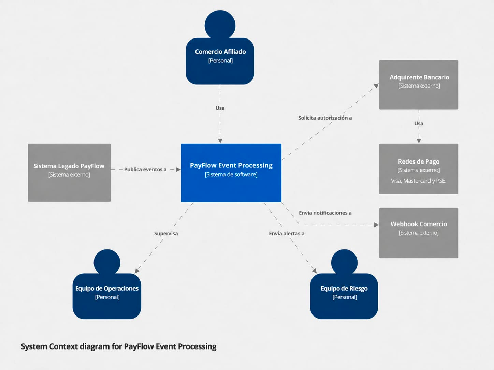
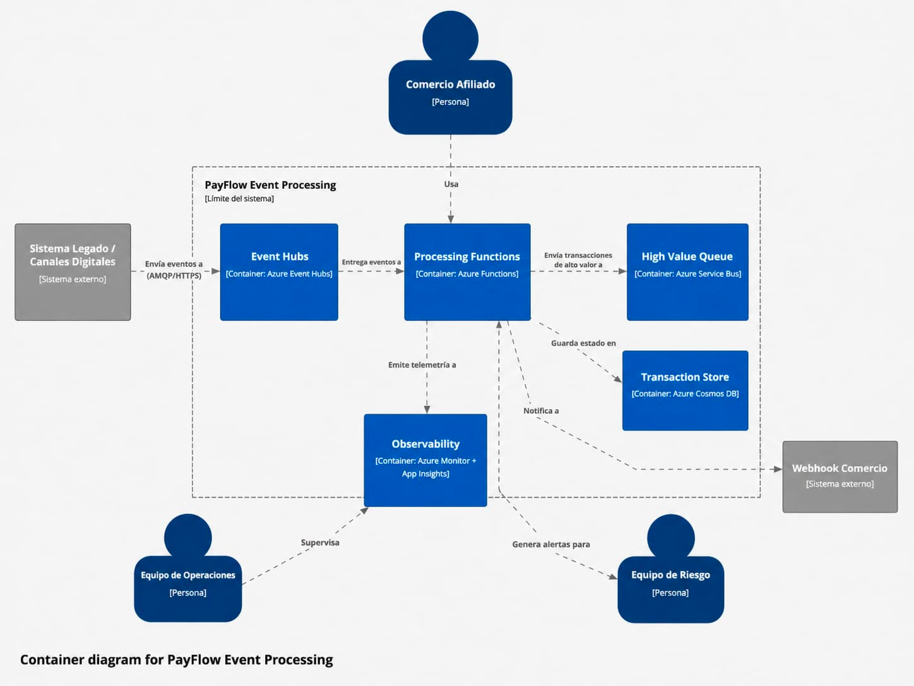
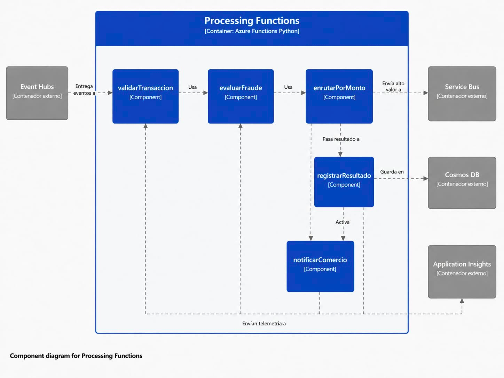

# Caso 3 - Procesamiento de Eventos en Tiempo Real

## 1. Portada

**Institución:** Tecnológico de Antioquia  
**Curso:** Computación en la Nube  
**Semestre:** 2026-1  
**Caso:** Caso 3 - Procesamiento de Eventos en Tiempo Real  
**Empresa:** PayFlow  
**Plataforma:** Microsoft Azure  
**Entrega:** Repositorio GitHub público con README.md como documento principal  

## 2. Integrantes

- Integrante 1:Yean Kevin Marquez Alvarez
- Integrante 2:Juan Camilo Arroyave Monsalve
- Integrante 3:Yesid Mateo Hincapie Duque
- Integrante 4:Diover Farley Sanchez Salazar
- Integrante 5:Jhon Alexander Múnera Peláe

## 3. Contexto del caso

PayFlow es una fintech colombiana que procesa pagos digitales para pequeños y medianos comercios. Actualmente opera con una arquitectura monolítica y síncrona, lo que genera problemas de escalabilidad, acoplamiento, observabilidad limitada y detección tardía de fraude.

## 4. Problemas identificados

PayFlow tiene actualmente una arquitectura monolítica y síncrona construida en 2020. Cada transacción pasa por un flujo secuencial de validación, autorización, registro y notificación. Esta forma de procesamiento genera varios problemas críticos.

### 4.1 Cuello de botella en picos de demanda

El sistema actual procesa aproximadamente 40 transacciones por segundo. En temporada alta, el volumen de transacciones puede superar esta capacidad, generando acumulación de solicitudes, tiempos de respuesta superiores a 8 segundos y posibles rechazos en terminales de los comercios.

### 4.2 Falta de prioridad entre transacciones

Una transacción de bajo valor y una transacción de alto valor pasan por el mismo flujo y con la misma prioridad. Esto puede ocasionar que un alto volumen de micropagos bloquee transacciones de mayor importancia económica.

### 4.3 Detección de fraude reactiva

El sistema actual aplica reglas antifraude después de autorizar la transacción. Esto significa que, cuando se detecta una operación sospechosa, el dinero ya pudo quedar comprometido.

### 4.4 Observabilidad limitada

No existe un monitoreo centralizado del flujo de transacciones. El equipo de operaciones puede enterarse de fallos por quejas de los comercios, en lugar de recibir alertas automáticas.

### 4.5 Acoplamiento entre autorización y notificación

Si el servicio de notificación al comercio falla, la transacción completa puede verse afectada, aunque la autorización bancaria haya sido exitosa. Esto genera inconsistencias entre PayFlow y las redes de pago.

## 5. Requerimientos no funcionales

La nueva arquitectura debe cumplir con los siguientes requerimientos definidos para PayFlow:

| Requerimiento | Métrica objetivo | Motivación |
|---|---|---|
| Throughput | Procesar hasta 500 transacciones por segundo | Soportar picos de temporada alta sin degradación |
| Latencia de autorización | Menos de 2 segundos en P99 | Evitar timeouts en terminales de comercios |
| Garantía de entrega | At-least-once para transacciones críticas | Ninguna transacción crítica debe perderse |
| Detección de fraude | Evaluación en tiempo real antes de autorizar | Reducir fraude antes de comprometer dinero |
| Desacoplamiento | Notificaciones independientes del flujo principal | Evitar que fallos de webhook reviertan autorizaciones válidas |
| Observabilidad | Alertas automáticas con latencia menor a 30 segundos | Detectar anomalías antes de que los comercios reporten |

## 6. Arquitectura propuesta

La arquitectura propuesta para PayFlow está basada en eventos. El objetivo es desacoplar la entrada de transacciones, el procesamiento, la priorización de transacciones de alto valor, la persistencia del estado y la observabilidad.

### 6.1 Flujo general

La arquitectura propuesta para PayFlow está basada en eventos. El objetivo es desacoplar la entrada de transacciones, el procesamiento, la priorización de transacciones de alto valor, la persistencia del estado y la observabilidad.

Sistema legado / Canales digitales
        |
        v
Azure Event Hubs
        |
        v
Azure Functions
        |
        +--> Azure Service Bus, si la transacción supera $5.000.000 COP
        |
        +--> Azure Cosmos DB
        |
        +--> Azure Monitor + Application Insights

## 7. Modelo C4

El modelo C4 permite documentar la arquitectura de software en diferentes niveles de abstracción: contexto, contenedores y componentes. Para este caso se desarrollan los diagramas C1, C2 y C3.

### 7.1 C1 - Contexto

El diagrama de contexto muestra a PayFlow como sistema principal y su relación con actores y sistemas externos.

En este nivel se identifican los siguientes elementos:

- Comercio afiliado
- Sistema legado de PayFlow
- PayFlow Event Processing
- Adquirente bancario
- Redes de pago
- Webhook del comercio
- Equipo de operaciones
- Equipo de riesgo

### 7.2 C2 - Contenedores

El diagrama de contenedores muestra los servicios principales de Azure que componen la solución.

Los contenedores principales son:

- Azure Event Hubs
- Azure Functions
- Azure Service Bus
- Azure Cosmos DB
- Azure Monitor + Application Insights

### 7.3 C3 - Componentes

El diagrama de componentes muestra el interior del contenedor Azure Functions.

Los componentes principales son:

- validarTransaccion
- evaluarFraude
- enrutarPorMonto
- registrarResultado
- notificarComercio

## 8. Decisiones arquitectónicas

Pendiente por documentar.

## 9. Implementación del flujo crítico

Pendiente por documentar.

## 10. Evidencias

Pendiente por agregar capturas.

## 11. Pruebas realizadas

Pendiente por documentar.

## 12. Conclusiones

Pendiente por documentar.

## 13. Referencias

- Microsoft Azure Architecture Center
- Azure Event Hubs Documentation
- Azure Functions Documentation
- Azure Service Bus Documentation
- Azure Cosmos DB Documentation
- Azure Monitor Documentation